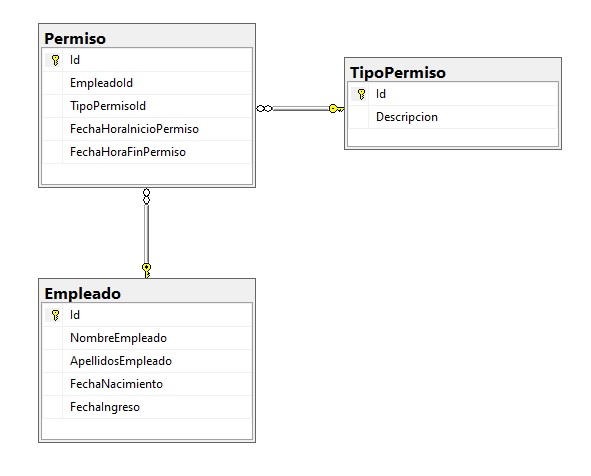

# AppPermisosSolution

1 - Descargar o clonar el repositorio

2 - Ejecutar sobre una sintacia de SqlServer, el archivo "Create_all.sql", este crea:

    - La Base de datos
    
    - Las tablas y las relaciones
    
    - Un usuario expecífico, para realizar la conexión con los pemriso sobre la base de datos
    
    - Las vistas (una sola)
    
    - Los procedimientos almacenados
    
    
3 - Editar el archivo "appsettings.json", que se encuentra dentro de la carpeta "WebApp", específicamente la cadena de conexión "ConnectionStringPersonal", de acuerdo a  la conexión y configuración de sus instancia de SqlServer

4 - El diagrama de clases 

    La tabla "Permiso", esta bien normalizada, por lo siguiente.

    1FN
    Todos los atributos son atómicos 
    (sin embargo  con la fecha y horas, podrían manejarse de forma separada, todo depende del objetivo y tratamiento que se tenga que hacer con la información)

    No existen variación de columnas entre las filas, es decir todas las  filas tiene el mismo número de columnas

    Todos los campos que no son clave se identifican y acceden por el campo clave Id (llave primaria)

    El orden de registro so columnas no afecta el significado del elemento o fila

    2FN

    Está en 1FN

    No existen dependencias parciales y todos los atributos dependen únicamente de la clave prinicipal.

    3FN

    Está en 2FN

    No existen dependencias parciales y todos los atributos dependen únicamente de la clave prinicipal

    - Es decir en esta tabla se muestran dos entidades adicionales Empleado y Tipo Permiso, estan han sido separadas 
    y dependen del campo llave de cada una de ellas que es referenciada en la tabla Permiso.
    

No se sugiere ninguna modificación a la estructura, sin embargo, y como se mencionó anteiormente con relación a la atomicidad de los campos en el caso que se requiera se deben separar: apellidos por apellido paterno y apeliido materno; y las fechas y horas de inicio con sus campos individuales para fecha y hora. Por lo que la tabla resultaria con los siguientes atributos

Id, EmpleadoId, TipoPermisoId, FechaInicio, HoraInicio, FechaFin, HoraFin

Esto es muy subjetivo, porque como se indicó, todo depende de la forma en como se va agestionar la información, o la necesidad de ciertas consultas o validaciones, por ejemplo que los permisos registrados deben inicarse o finalizarse dentro del horario de trabajo, en este caso es conveniente seprara los campos fechas y horas.

NOTA

Con relación al planteamiento del ejercicio, no se específico la creación del campo descripción de la tabla TIPO PERMISO, sin embargo y en base al planteamiento, de un anterior ejercicio enviado, se asumió que este campo tenía que existir
